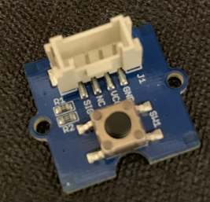
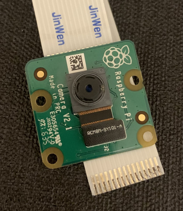
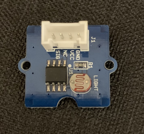
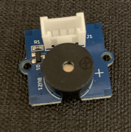
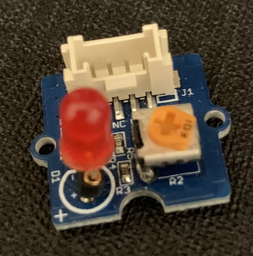
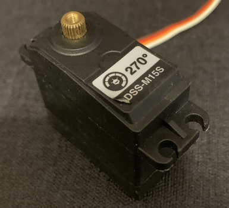

<div align="center">

# Garage Automatique

<a rel="license" href="http://creativecommons.org/licenses/by-nc-nd/4.0/"></a><br />Ce(tte) œuvre est mise à disposition selon les termes de la <a rel="license" href="http://creativecommons.org/licenses/by-nc-nd/4.0/">Licence Creative Commons Attribution - Pas d&#39;Utilisation Commerciale - Pas de Modification 4.0 International</a>.

---

Version anglaise de ce document : [README.md](README.md)
<a href="README.md"></a>

---

### **Description**

En tant que conducteur, il vous est sûrement déjà arrivé de vous retrouver
devant votre garage et de ne pas trouver votre télécommande pour ouvrir
la porte, ou bien de constater que les piles sont faibles et que le signal est
peu puissant, ce qui peut vous faire perdre du temps. Le garage
automatique vise à remplacer cette technologie archaïque par une
ouverture automatique de la porte grâce à un simple appel de phare.
De plus, le garage automatique est doté de plusieurs fonctionnalités qui lui permettent d'assurer la gestion complète de votre garage.

---

[Installation et Exécution](#installation) •
[Documentation](#documentation) •
[Contributions](#contributions)

**Veuillez lire attentivement le [Manuel Utilisateur](Guide_Utilisation.pdf) fourni**
</div>


## Fonctionnalités

- La reconnaissance de votre plaque à l’entrée du garage, qui
vous laisse rentrer seulement si votre plaque à les bons droits
d'accès
- Un historique des voitures garées dans votre garage
consultable à tout moment depuis votre smartphone
- Un radar de recul intégré
- Un menu pour gérer l’historique et les options.


## Table des matières

- [Installation](#installation)
  - [Prérequis](#prérequis)
  - [Branchements et Configuration](#branchements-et-configuration)
  - [Mise en place physique](#mise-en-place-physique)
  - [Exécution](#exécution)
  - [Utilisation Générale](#utilisation-générale)
  - [Utilisation du Menu](#utilisation-du-menu)
- [Documentation](#documentation)
  - [Captures d'écran](#captures-décran)
  - [Structure du projet](#structure-du-projet)
  - [FAQ](#faq)
- [Contributions](#contributions)
  - [Auteurs](#auteurs)
  - [Contrôle des versions](#contrôle-des-versions)
  - [Historique](#historique)

# Installation
<sup>[(Retour en haut)](#table-des-matières)</sup>

## Prérequis
<sub>[(Retour en haut)](#table-des-matières)</sub>

Ce projet nécessite une Raspberry Pi ainsi que les capteurs suivants :

- Écran (1)
- Bouton (x2) (2)
- Caméra (3)
- Capteur de lumière (x2) (4)
- Capteur à ultrasons (x2) (5)
- Buzzer (6)
- LED (7)
- Moteur (8)

|  |  |  |
| :---: | :---: | :---: |
|  |  |  |
| 1 | 2 | 3 |
|  |  |  |
| 4 | 5 | 6 |
|  |  |  |
| 7 | 8 |  |


Ce projet est codé en Python.

En plus de l'installation par défaut de Python 3.5 sur la Raspberry Pi, vous devez également installer Python 3.7. N'importe quelle sous-version de Python 3.7 fera l'affaire, mais essayez de choisir la dernière.

Python 3.7 peut être trouvé sur le site officiel de Python [python.org](https://www.python.org). **N'ÉCRASEZ PAS LA VERSION PYTHON 3.5 DÉJÀ INSTALLÉE SUR VOTRE RASPBERRY PI.**

Une fois que vous avez installé Python 3.7, vous devez installer le module `pytesseract` à l'aide de `pip3.7`. Pour cela, tapez la commande suivante dans un terminal :

```bash
pip3.7 install pytesseract
```

Vous devez également installer le logiciel Tesseract. Tapez cette commande dans un terminal :

```bash
sudo apt install tesseract-ocr -y
```

**IL EST NÉCESSAIRE DE CONNECTER LA RASPBERRY PI À INTERNET.** (Si vous utilisez SSH et êtes déjà connecté à Internet, cela suffit.)

## Branchements et Configuration
<sup>[(Retour en haut)](#table-des-matières)</sup>

Tout d'abord, vous devez cloner le dépôt :

```bash
git clone <repo_url>
```

Pour le branchement des capteurs, procéder ainsi:
- Ultrason -> D3
- Ecran -> I2C1
- Led -> D4
- Capteur Lumière pour rentrer -> A0
- Capteur Lumière pour sortir -> A1
- Bouton Scroll -> D2
- Bouton Confirm -> D7
- Buzzer -> D8
- Moteur -> 
  - Power : fil rouge -> pin 2
  - Ground : fil marron -> pin 6 
  - Input : fil orange -> pin 11 C'EST LE PIN GPIO 17
- Caméra -> Port Caméra

Finalement, installer les modules python nécessaires :

```bash
pip3.5 install -r requirements.txt
```

## Mise en place physique
<sup>[(Retour en haut)](#table-des-matières)</sup>

Notre équipe doit normalement installer le dispositif dans votre garage,
mais si vous devez le faire vous-même, voici comment placer les différents
capteurs :
- Placez le corps du dispositif dans un endroit sec à l'abri de la chaleur
excessive et de la lumière.
- Placez la caméra et le capteur de lumière avec l'étiquette rouge à
l'extérieur du garage, au niveau des plaques d'immatriculation des
véhicules entrant.
- Placez le capteur de lumière avec l'étiquette verte au même niveau à
l'intérieur du garage.
- Placez le radar de distance (capteur ultrason et buzzer) au fond du
garage face aux véhicules qui entrent.
- Placez l'écran et les boutons dans un endroit confortable pour
l'utilisation.
- Placez la LED à un endroit visible proche de l'entrée du garage.
Reliez le moteur de votre garage au dispositif, ou reliez le moteur
fourni à votre garage.


## Exécution
<sup>[(Retour en haut)](#table-des-matières)</sup>

Notre équipe a tout mis en œuvre pour rendre l'utilisation du dispositif la
plus facile possible. Pour allumer le dispositif, il suffit de le brancher à une
source d'alimentation. Le programme se lance automatiquement sans
intervention de votre part et le dispositif est immédiatement prêt à être
utilisé. Assurez-vous que votre dispositif est bien connecté à Internet via
Ethernet ou Wi-Fi (configuré par notre équipe) afin de pouvoir envoyer
l'historique du garage.

Si vous souhaitez le faire à la main, voici comment lancer le programme :

Pour executer le programme, il suffit de lancer le fichier `main.py` avec Python 3.5 :

```bash
cd garage
python3.5 main.py
```

Ou plus simplement avec le script de lancement fourni :

```bash
./lancement.sh
```

Si vous souhaitez eteindre le dispositif, il suffit de le debrancher de la source d'alimentation.

## Utilisation Générale
<sup>[(Retour en haut)](#table-des-matières)</sup>

Voici comment utiliser le garage automatique :
1. Vous rentrez du travail et voulez savoir si vous pouvez garer votre
voiture dans le garage de la maison ou si vous devez chercher une
place de parking dans la rue car la personne avec qui vous vivez a déjà
garé la sienne.
2. Vous regardez le site mis à disposition sur votre téléphone qui vous
indique que la place est libre, elle est en effet libre.
3. Vous arrivez devant chez vous, vous positionnez devant la porte du
garage et effectuez un appel de phare.
4. Le dispositif lit alors votre plaque d'immatriculation et vérifie vos droits
d'accès.
5. L'autorisation est accordée, la porte du garage
automatiquement et vous rentrez donc dans le garage.
s'ouvre
6. Vous vous approchez du mur du fond jusqu'à ce que les bruits du
radar de recul vous indiquent que vous êtes assez près.
7. Vous immobilisez votre voiture.
8. Le dispositif remarque que votre voiture est bien garée et ferme donc
la porte du garage.
9. Vous pouvez rentrer dans votre maison.

Une fois que vous voulez sortir :
1. Vous montez dans votre voiture.
2. Vous effectuez un appel de phare.
3. Vous attendez que le garage s’ouvre et sortez du garage.
4. Le garage se referme automatiquement

## Utilisation du Menu
<sup>[(Retour en haut)](#table-des-matières)</sup>

Le menu offre plusieurs fonctionnalités et outils de gestion de l'historique.
Pour accéder au menu, appuyez sur le bouton de "scrolling" (indiqué sur
l'étiquette). Le menu comporte plusieurs pages, pour les parcourir, utilisez
à nouveau le bouton "scrolling". Voici les pages du menu et leurs
fonctionnalités :
- Activer/Désactiver le bruit du radar de recul. Le garage se
fermera tout de même automatiquement, sauf en mode
silencieux, parfait quand vous souhaitez du calme.
- Envoyer l'historique sur le site web. L’historique est celui décrit
à la page précédente.
- Consulter la dernière personne qui était garée avant vous en
récupérant sa plaque d'immatriculation sur le site web.
Effacer l'historique. Attention, l'effacement de l'historique est
irréversible.

Pour sélectionner une action dans le menu, allez sur la page
correspondante et appuyez sur le bouton "confirmer" (indiqué sur
l'étiquette). Si vous sortez accidentellement du menu, il vous suffit de le
rouvrir en appuyant de nouveau sur le bouton "scrolling".

# Documentation
<sup>[(Retour en haut)](#table-des-matières)</sup>

Une documentation complète est fournie dans le [Manuel Utilisateur](Guide_Utilisation.pdf).

## Menu
<sup>[(Retour en haut)](#table-des-matières)</sup>

L'historique du garage enregistre les informations concernant les voitures
qui ont été garées dans votre garage. Cet historique comprend :
- L'identifiant de la voiture (indique le nombre et l'ordre dans
- lequel les voitures ont été garées)
- La plaque d'immatriculation de la voiture
- La date d'entrée dans le garage
- Le temps passé garé
- Le fait que la voiture soit toujours garée dans le garage (si elle y
est toujours garée)

Cet historique est automatiquement envoyé sur le site Dweet au lien
[dweet.io/follow/GarageFASEProj](https://dweet.io/follow/GarageFASEProj) chaque fois qu'une voiture quitte le garage
et toutes les 6 heures.

Voici un exemple d'historique :


## Structure du projet
<sup>[(Retour en haut)](#table-des-matières)</sup>

Voici la structure du projet :

```bash
.
├── garage
│   ├── buttonconfirm.py
│   ├── buttonscroll.py
│   ├── buzzer.py
│   ├── camera.py
│   ├── capteur_lumiere_in.py
│   ├── capteur_lumiere_out.py
│   ├── grovepi.py
│   ├── historique.txt
│   ├── led.py
│   ├── main.py
│   ├── menu.py
│   ├── moteur.py
│   ├── plaque1.jpg
│   ├── plaque2.png
│   ├── plaque.jpg
│   ├── plaquetext.txt
│   ├── README.txt
│   ├── reconnaissance.py
│   ├── seconds.py
│   ├── senddweet.py
│   └── ultrason.py
├── lancement.sh
├── LICENSE.txt
├── Manuel_Utilisateur.pdf
├── README.fr.md
├── README.md
└── requirements.txt
```

## FAQ
<sup>[(Retour en haut)](#table-des-matières)</sup>

**Est-ce que le garage automatique peut détecter différents types de véhicules ?** 

Oui, à condition que la caméra soit installée à une hauteur adéquate pour bien capturer la plaque d'immatriculation.

**Je suis préoccupé par ma vie privée, mon adresse est-elle publiée sur Internet ?** 

Non, le garage automatique ne publie pas votre localisation sur Internet et votre localisation n'est pas stockée dans les données de l'historique du garage.

**Si j'envoie plusieurs fois l'historique sur le site web, est-ce que cela s'affichera plusieurs fois ?** 

Non, le système est conçu pour que même si vous envoyez plusieurs fois de suite l'historique, il ne s'affichera qu'une seule fois sur le site web.

# Contributions
<sup>[(Retour en haut)](#table-des-matières)</sup>

## Auteurs
<sup>[(Retour en haut)](#table-des-matières)</sup>

- [**Alexandre Deloire**](https://github.com/alexdeloire)
- [**Rémi Jorge**](https://github.com/RemiJorge)

## Contrôle des versions
<sup>[(Retour en haut)](#table-des-matières)</sup>

Git est utilisé pour le contrôle des versions. Le projet a été réalisé en itérations de sprint, avec une nouvelle version du projet publiée à la fin de chaque sprint.

## Historique
<sup>[(Retour en haut)](#table-des-matières)</sup>

Les différentes itérations de sprint du projet sont disponibles dans ce [dépôt](https://github.com/alexdeloire/automatic_garage).