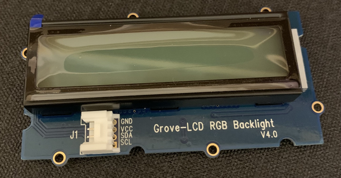
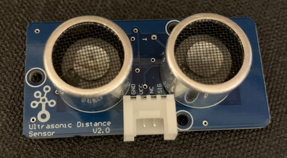

<div align="center">

# Automatic Garage

<a rel="license" href="http://creativecommons.org/licenses/by-nc-sa/4.0/"></a><br />This work is licensed under a <a rel="license" href="http://creativecommons.org/licenses/by-nc-sa/4.0/">Creative Commons Attribution-NonCommercial-ShareAlike 4.0 International License</a>.

---

Read the French version of this document: [README.fr.md](README.fr.md)
<a href="README.fr.md"></a>


---

### **Description**

As a driver, you have probably encountered situations where you're in front of your garage and can't find your remote control to open the door, or you realize that the batteries are weak and the signal is weak, causing you to lose time. The automatic garage aims to replace this outdated technology with an automatic door opening using a simple headlight flash. Additionally, the automatic garage has several features that allow it to handle complete garage management.

---

[Installation and Execution](#installation) •
[Documentation](#documentation) •
[Contributions](#contributions)

**Please read the [User Manual](Manuel_Utilisateur.pdf) carefully**
</div>


## Features

- Recognition of your license plate at the garage entrance, allowing entry only if your plate has the correct access rights
- History of parked cars in your garage, accessible anytime from your smartphone
- Integrated parking sensor
- Menu for managing history and options.


## Table of Contents

- [Installation](#installation)
  - [Prerequisites](#prerequisites)
  - [Connections and Configuration](#connections-and-configuration)
  - [Physical Setup](#physical-setup)
  - [Execution](#execution)
  - [General Usage](#general-usage)
  - [Menu Usage](#menu-usage)
- [Documentation](#documentation)
  - [Screenshots](#screenshots)
  - [Project Structure](#project-structure)
  - [FAQ](#faq)
- [Contributions](#contributions)
  - [Authors](#authors)
  - [Version Control](#version-control)
  - [History](#history)

# Installation
<sup>[(Back to top)](#table-of-contents)</sup>

## Prerequisites
<sub>[(Back to top)](#table-of-contents)</sub>

This project requires a Raspberry Pi and the following sensors:

- Screen (1)
- Button (x2) (2)
- Camera (3)
- Light Sensor (x2) (4)
- Ultrasonic Sensor (x2) (5)
- Buzzer (6)
- LED (7)
- Motor (8)

|  | Sensors |  |
| :---: | :---: | :---: |
|  |  |  |
| 1 | 2 | 3 |
|  |  |  |
| 4 | 5 | 6 |
|  |  |  |
| 7 | 8 |  |


This project is coded in Python.

In addition to the default installation of Python 3.5 on the Raspberry Pi, you also need to install Python 3.7. Any subversion of Python 3.7 will work, but try to choose the latest one.

Python 3.7 can be found on the official Python website [python.org](https://www.python.org). **DO NOT OVERWRITE THE ALREADY INSTALLED PYTHON 3.5 VERSION ON YOUR RASPBERRY PI.**

Once you have installed Python 3.7, you need to install the `pytesseract` module using `pip3.7`. To do this, type the following command in a terminal:

```bash
pip3.7 install pytesseract
```

You also need to install the Tesseract software. Type this command in a terminal:

```bash
sudo apt install tesseract-ocr -y
```

**THE RASPBERRY PI MUST BE CONNECTED TO THE INTERNET.** (If you're using SSH and are already connected to the internet, that's sufficient.)

## Connections and Configuration
<sup>[(Back to top)](#table-of-contents)</sup>

First, you need to clone the repository:

```bash
git clone <repo_url>
```

For sensor connections, proceed as follows:
- Ultrasonic -> D3
- Screen -> I2C1
- LED -> D4
- Light Sensor for entry -> A0
- Light Sensor for exit -> A1
- Scroll Button -> D2
- Confirm Button -> D7
- Buzzer -> D8
- Motor ->
  - Power: red wire -> pin 2
  - Ground: brown wire -> pin 6
  - Input: orange wire -> pin 11 THIS IS GPIO PIN 17
- Camera -> Camera Port

Finally, install the necessary Python modules:

```bash
pip3.5 install -r requirements.txt
```

## Physical Setup
<sup>[(Back to top)](#table-of-contents)</sup>

Our team would typically install the device in your garage, but if you need to do it yourself, here's how to position the different sensors:
- Place the device's body in a dry place away from excessive heat and light.
- Place the camera and the red-labeled light sensor outside the garage, at the level of entering vehicle license plates.
- Place the green-labeled light sensor at the same level inside the garage.
- Place the distance radar (ultrasonic sensor and buzzer) at the back of the garage facing incoming vehicles.
- Place the screen and buttons in a comfortable location for use.
- Place the LED in a visible location near the garage entrance.
Connect the garage motor to the device, or connect the provided motor to your garage.

## Execution
<sup>[(Back to top)](#table-of-contents)</sup>

Our team has made every effort to make the device as user-friendly as possible. To turn on the device, simply plug it into a power source. The program starts automatically without your intervention, and the device is immediately ready to use. Ensure that your device is connected to the internet via Ethernet or Wi-Fi (configured by our team) to be able to send garage history.

If you want to do it manually, here's how to run the program:

To run the program, simply launch the `main.py` file with Python 3.5:

```bash
cd garage
python3.5 main.py
```

Or more simply using the provided launch script:

```bash
./launch.sh
```

If you want to turn off the device, simply disconnect it from the power source.

## General Usage
<sup>[(Back to top)](#table-of-contents)</sup>

Here's how to use the automatic garage:
1. You return from work and want to know if you can park your car in the house garage or if you need to find street parking because the person you live with has already parked theirs.
2. You check the website provided on your phone, which indicates that the space is free, and indeed it is.
3. You arrive in front of your home, position yourself in front of the garage door, and flash your headlights.
4. The device then reads your license plate and checks your access rights.
5. Authorization is granted, and the garage door opens automatically, allowing you to enter the garage.
6. You move toward the back wall until the reverse radar sounds indicate that you are close enough.
7. You park your car.
8. The device recognizes that your car is parked correctly and therefore closes the garage door.
9. You can enter your house.

When you want to exit:
1. You get into your car.
2. You flash your headlights.
3. You wait for the garage to open and then exit the garage.
4. The garage closes automatically.

## Menu Usage
<sup>[(Back to top)](#table-of-contents)</sup>

The menu offers several features and history management tools. To access the menu, press the "scrolling" button (indicated on the label). The menu has multiple pages; use the "scrolling" button again to navigate through them. Here are the menu pages and their functions:
- Activate/Deactivate the reverse radar noise. The garage will still close automatically, except in silent mode, which is useful when you want peace and quiet.
- Send history to the website. The history is as described on the previous page.
- Check the last person parked before you by retrieving their license plate from the website.
- Clear the history. Please note that clearing history is irreversible.

To select an action in the menu, go to the corresponding page and press the "confirm" button (indicated on the label). If you accidentally exit the menu, simply reopen it by pressing the "scrolling" button again.

# Documentation
<sup>[(Back to top)](#table-of-contents)</sup>

Comprehensive documentation is provided in the [User Manual](Manuel_Utilisateur.pdf).

## Menu
<sup>[(Back to top)](#table-of-contents)</sup>

The garage history records information about cars that have been parked in your garage. This history includes:
- Car identifier (indicates the number and order in which cars were parked)
- Car license plate
- Entry date into the garage
- Time parked
- Whether the car is still parked in the garage (if it's still there)

This history is automatically sent to the Dweet website at [dweet.io/follow/GarageFASEProj](https://dweet.io/follow/GarageFASEProj) whenever a car leaves the garage and every 6 hours.

Here's an example of history:


## Project Structure
<sup>[(Back to top)](#table-of-contents)</sup>

Here's the project structure:

```bash
.
├── garage
│   ├── buttonconfirm.py
│   ├── buttonscroll.py
│   ├── buzzer.py
│   ├── camera.py
│   ├── capteur_lumiere_in.py
│   ├── capteur_lumiere_out.py
│   ├── grovepi.py
│   ├── historique.txt
│   ├── led.py
│   ├── main.py
│   ├── menu.py
│   ├── moteur.py
│   ├── plaque1.jpg
│   ├── plaque2.png
│   ├── plaque.jpg
│   ├── plaquetext.txt
│   ├── README.txt
│   ├── reconnaissance.py
│   ├── seconds.py
│   ├── senddweet.py
│   └── ultrason.py
├── lancement.sh
├── LICENSE.txt
├── Manuel_Utilisateur.pdf
├── README.fr.md
├── README.md
└── requirements.txt
```

## FAQ
<sup>[(Back to top)](#table-of-contents)</sup>

**Can the automatic garage detect different types of vehicles?**

Yes, as long as the camera is installed at an appropriate height to capture the license plate properly.

**I'm concerned about my privacy; is my location published on the internet?**

No, the automatic garage does not publish your location on the internet, and your location is not stored in the garage history data.

**If I send the history to the website multiple times, will it be displayed multiple times?**

No, the system is designed so that even if you send the history multiple times in a row, it will be displayed only once on the website.

# Contributions
<sup>[(Back to top)](#table-of-contents)</sup>

## Authors
<sup>[(Back to top)](#table-of-contents)</sup>

- [**Alexandre Deloire**](https://github.com/alexdeloire)
- [**Rémi Jorge**](https://github.com/RemiJorge)

## Version Control
<sup>[(Back to top)](#table-of-contents)</sup>

Git is used for version control. The project was carried out in sprint iterations, with a new version of the project released at the end of each sprint.

## History
<sup>[(Back to top)](#table-of-contents)</sup>

The different sprint iterations of the project are available in this [repository](https://github.com/alexdeloire/automatic_garage).